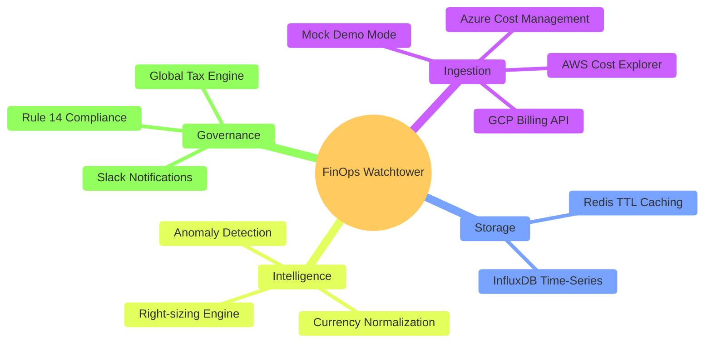
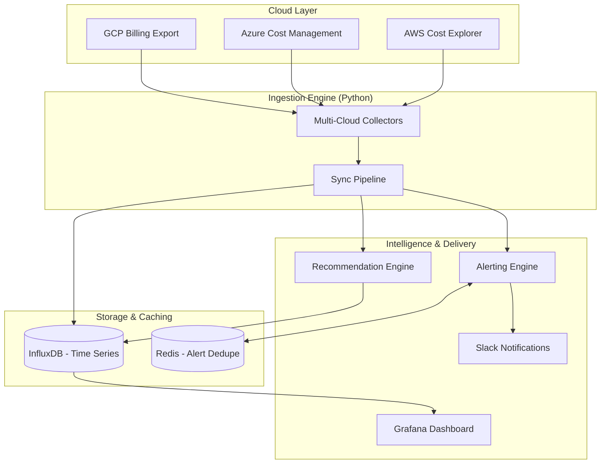
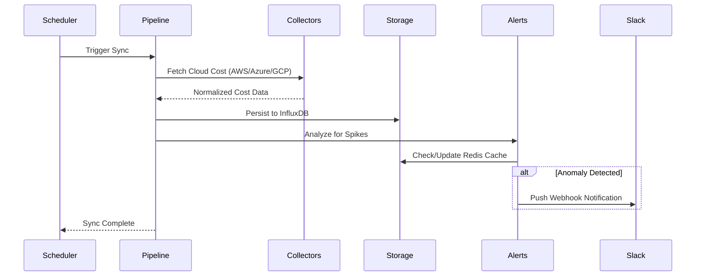
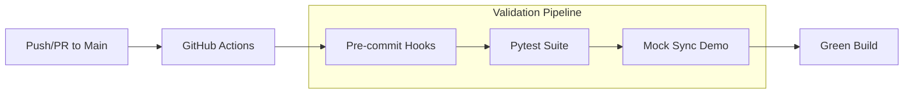

# Multi-Cloud FinOps Watchtower


A robust, enterprise-grade Financial Operations (FinOps) platform engineered to centralize, analyze, and optimize cloud infrastructure costs across Amazon Web Services (AWS), Microsoft Azure, and Google Cloud Platform (GCP).

---

## 1. Project Overview

In modern microservice architectures, organizations frequently adopt multi-cloud strategies to avoid vendor lock-in and leverage specific cloud capabilities. However, this creates a massive operational blind spot: **cost fragmentation**. 

Finance and DevOps teams are often forced to manually reconcile disparate billing reports, leading to delayed anomaly detection and wasted capital on orphaned resources.

**The FinOps Command Center** bridges this gap. It acts as a centralized telemetry hub that autonomously ingests cross-provider billing data, normalizes it into a high-performance time-series database, and visualizes the financial health of your infrastructure in real-time.

### Business Value
❖ **Instant Visibility:** Eliminates the "end-of-month billing shock" by providing daily burn rate tracking.
❖ **Automated Governance:** Replaces manual auditing with automated anomaly detection.
❖ **Capital Optimization:** Actively surfaces orphaned volumes, idle instances, and right-sizing opportunities.

---

## 2. Core Capabilities



➤ **Cross-Cloud Ingestion Engine:** Seamlessly authenticates and pulls granular cost metrics using official cloud SDKs (`boto3`, `azure-mgmt-cost`, `google-cloud-billing`).

➤ **Time-Series Optimization:** Utilizes InfluxDB to handle high-cardinality financial data, allowing sub-second querying of historical cost trends.

➤ **Proactive Alerting Matrix:** Employs statistical baseline comparisons to detect sudden spending spikes, triggering immediate webhook notifications to Slack/Teams.

➤ **Alert Deduplication:** Integrates Redis caching to implement Time-To-Live (TTL) based alert throttling, preventing "alert fatigue" during sustained anomalies.

➤ **Live Currency Normalization:** Dynamically fetches daily exchange rates via open APIs to convert all multi-regional cloud bills (e.g., EUR, INR) into a unified base currency (USD) for mathematically accurate dashboard aggregations.

➤ **Global Tax & Compliance Engine:** A highly configurable ruleset that applies regional taxes (e.g., 18% GST, 20% VAT) to compute resources and calculates compliance "notional costs" (like India's Rule 14) on exempt resources, providing a true "Landed Cost" to the finance team.

➤ **Executive Dashboard:** A NOC-style (Network Operations Center) Grafana interface featuring glassmorphism design, zero-clutter typography, and aggressive color-coding for rapid cognitive processing.

---

## 3. System Architecture

The platform is designed with a decoupled, containerized 4-tier architecture.



### Data Flow Lifecycle



### Component Breakdown:
▪ **Data Pipeline (Python):** Scheduled tasks that execute API calls to cloud providers, format the JSON responses, and handle retry/backoff logic.
▪ **Storage Layer (InfluxDB):** The core database optimized for timestamped financial metrics, tagged by `provider`, `service`, `region`, and `account_id`.
▪ **State Management (Redis):** Maintains the state of active anomalies. If an alert is triggered, a hash is stored with a TTL. Subsequent identical spikes are suppressed until the TTL expires.
▪ **Presentation Layer (Grafana):** Connects to InfluxDB via Flux queries to render the Executive Command Center.

---

## 4. Environment Prerequisites

Ensure your host machine or deployment server meets the following requirements:

▸ **Infrastructure:**
  ▫ Docker Engine (v20.10+)
  ▫ Docker Compose (v2.0+)
  ▫ Python 3.10+ (for local development/testing)

▸ **Cloud Provider Credentials:**
  ▫ **AWS:** IAM User Access Key & Secret (Requires `ce:GetCostAndUsage` permissions)
  ▫ **Azure:** Service Principal (Client ID, Tenant ID, Secret) with `Cost Management Reader` role.
  ▫ **GCP:** Service Account JSON Key with `Billing Account Administrator` permissions.

▸ **Notifications:**
  ▫ A valid Slack Incoming Webhook URL.

---

## 5. Deployment Guide

### 5.1. Repository Setup
```bash
git clone https://github.com/surya-edict/MultiCloud-Watchtower.git
cd MultiCloud-Watchtower
```

### 5.2. Configuration
Duplicate the example environment file and populate it with your specific credentials:
```bash
cp .env.example .env
nano .env
```

*Required `.env` structure:*
```ini
# Core Platform Config
CLOUD_MODE=mock  # Set to 'live' for real cloud APIs
INFLUX_URL=http://localhost:8086
REDIS_HOST=localhost

# Global Tax & Compliance Engine
GLOBAL_TAX_RATE_PCT=18.0
APPLY_NOTIONAL_COST=true
NOTIONAL_COST_PCT=1.0

# Cloud Provider Credentials (AWS Example)
AWS_ENABLED=true
AWS_ACCESS_KEY_ID=YOUR_AWS_ACCESS_KEY_ID
AWS_SECRET_ACCESS_KEY=YOUR_AWS_SECRET_ACCESS_KEY

# Notifications
SLACK_WEBHOOK_URL=YOUR_SLACK_WEBHOOK_URL
```

### 5.3. Infrastructure Initialization
Deploy the storage and presentation layers using Docker Compose. This will spin up InfluxDB, Redis, and Grafana in detached mode:
```bash
docker-compose up -d
```

### 5.4. Pipeline Execution
Install the required Python dependencies and trigger the initial data sync:
```bash
python -m venv venv
source venv/bin/activate  # Windows: venv\Scripts\activate
pip install -r requirements.txt

# Run the data collection pipeline
python src/main.py --run-once
```
*Note: In a production environment, `src/main.py` should be configured as a systemd service or deployed as a Kubernetes CronJob.*

---

## 6. Accessing the Command Center

With the pipeline executed and data populated, access the visualization layer:

⮑ **URL:** `http://localhost:3000`
⮑ **Default Credentials:** `admin` / `admin`

Navigate to **Dashboards > SYS-OP: FINOPS COMMAND**. The dashboard is pre-provisioned via Grafana Infrastructure-as-Code (IaC) and will immediately reflect your cloud spend.

---

## 7. CI/CD & Automated Testing

The repository includes a GitHub Actions workflow (`cost-sync.yml`) that automates data synchronization and ensures platform stability.



➤ **Zero-Config Demo:** To ensure the repository's build status remains "Green" for public viewers, the CI/CD pipeline automatically defaults to **Mock Mode** if cloud provider secrets are not configured in GitHub Settings.

➤ **Conditional Execution:** Live cloud collectors are only activated in the pipeline if their respective `AWS_ACCESS_KEY_ID`, `GCP_PROJECT_ID`, or `AZURE_SUBSCRIPTION_ID` are present in GitHub Secrets.

➤ **Environment Isolation:** All sensitive variables are proxied through environment variables, preventing credential leakage in build logs.

---

## 8. Operational Commands

### 8.1. Docker Stack Management
Manage the infrastructure containers using Docker Compose:

| Action | Command |
| :--- | :--- |
| **Start Infrastructure** | `docker-compose up -d` |
| **Stop Infrastructure** | `docker-compose down` |
| **View App Logs** | `docker-compose logs -f app` |
| **Restart Application** | `docker-compose restart app` |
| **Check Container Status** | `docker-compose ps` |

### 8.2. Pipeline Execution
The Python data pipeline can be executed in different modes. Ensure your `PYTHONPATH` is set correctly:

**Linux / macOS:**
```bash
export PYTHONPATH=$PYTHONPATH:.
python src/main.py --run-once
```

**Windows (PowerShell):**
```powershell
$env:PYTHONPATH="."
python src/main.py --run-once
```

### 8.3. Demo / Mock Mode
To showcase the dashboard without live cloud credentials:
1. Open `.env` and set `CLOUD_MODE=mock`.
2. Run `python src/main.py --run-once`.
3. The dashboard will populate with synthetic EUR, INR, and USD data reflecting current tax rules.

### 8.4. Troubleshooting
If data is not appearing on the dashboard:
- **Check Containers:** Run `docker-compose ps` to ensure all 4 services are `Up`.
- **Verify InfluxDB Connectivity:** Check logs with `docker-compose logs influxdb`.
- **Manual Data Push:** Force a sync with `python src/main.py --run-once` and check for errors in the terminal.

---

## 9. Codebase Topography

```text
📂 MultiCloud-Watchtower/
│
├── 🎨 grafana/
│   ├── 📊 dashboards/
│   │   └── multicloud-cost-dashboard.json   # Exported NOC dashboard UI
│   └── ⚙️ provisioning/                      # Grafana IaC configuration
│
├── 🐍 src/
│   ├── 📡 collectors/
│   │   ├── ☁️ aws.py                         # Boto3 cost explorer integration
│   │   ├── ☁️ azure.py                       # Azure cost management integration
│   │   ├── ☁️ gcp.py                         # GCP billing API integration
│   │   └── 🧪 mock.py                        # Synthetic data generation
│   │
│   ├── 🛠️ service/
│   │   ├── 💱 currency.py                    # Exchange rate normalization
│   │   ├── ⚖️ taxes.py                       # Compliance & Tax engine
│   │   └── ⛓️ pipeline.py                    # Master orchestration
│   │
│   ├── 💾 storage/
│   │   ├── 📈 influx.py                      # Time-series protocols
│   │   └── ⚡ redis_cache.py                 # TTL caching logic
│   │
│   ├── 🔔 alerts/
│   │   ├── 📉 rules.py                       # Anomaly detection logic
│   │   └── 💬 slack.py                       # Webhook notifications
│   │
│   ├── 🗓️ scheduler/
│   │   └── 🏃 jobs.py                        # Pipeline orchestration
│   │
│   ├── 💡 recommendations/
│   │   └── 🧠 engine.py                      # Cost-saving intelligence
│   │
│   └── 🚀 main.py                            # Master execution script
│
├── 🐳 docker-compose.yml                     # Container topology
├── 📜 requirements.txt                       # Python dependencies
└── 📖 README.md                              # Project documentation
```

---

## 10. Extensibility & Contribution

This project is built with modularity in mind. The `collectors` directory uses a standard interface, making it trivial to add support for secondary providers (e.g., Oracle Cloud, DigitalOcean, Snowflake).

**To contribute:**
1. Fork the repository.
2. Create a feature branch (`git checkout -b feature/oracle-collector`).
3. Commit your changes (`git commit -m 'Add Oracle Cloud Cost Collector'`).
4. Push to the branch (`git push origin feature/oracle-collector`).
5. Open a Pull Request.

---

## 11. License & Legal

Distributed under the MIT License. See `LICENSE` for more information. 

This software is provided "as is", without warranty of any kind. The authors are not responsible for any cloud billing charges incurred while running this software.

---
